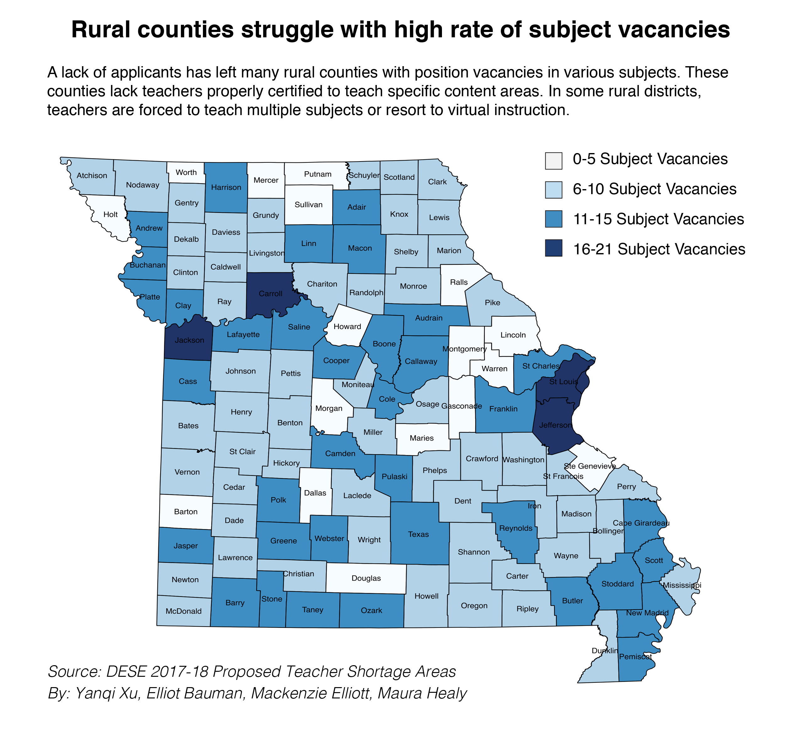

# Low salaries, waning interest drives teachers away from rural school districts

I did interviews for the story, and shot videos and photos. I **requested** the teacher shortage area report from Missouri Department of Elementary and Secondary Education, and built the interactive with **infogram**. I also produced the animated TV graphic based on analysis of the report. 



