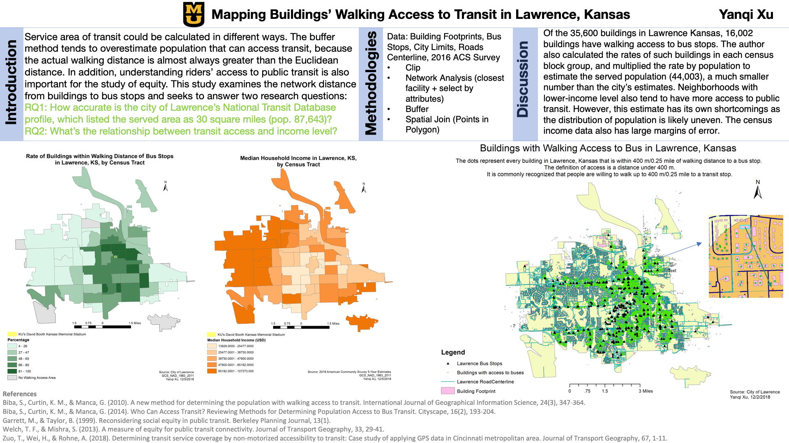

# Network Analysis
Being in the Midwest, too many times you can find the closest bus stop seemingly close on a map, but going there is not as easy as it appears. Sometimes you can't go straight there becuase there's no roadway.

400 meters, or 0.25 mile, is commonly regarded as the maximum amount of distance accetpeople for most people to walk to a transit stop.

In order to determine walking access to bus stops, I used network analysis, which focuses on distance along the network (roads, etc.) instead of absolute distance. 

